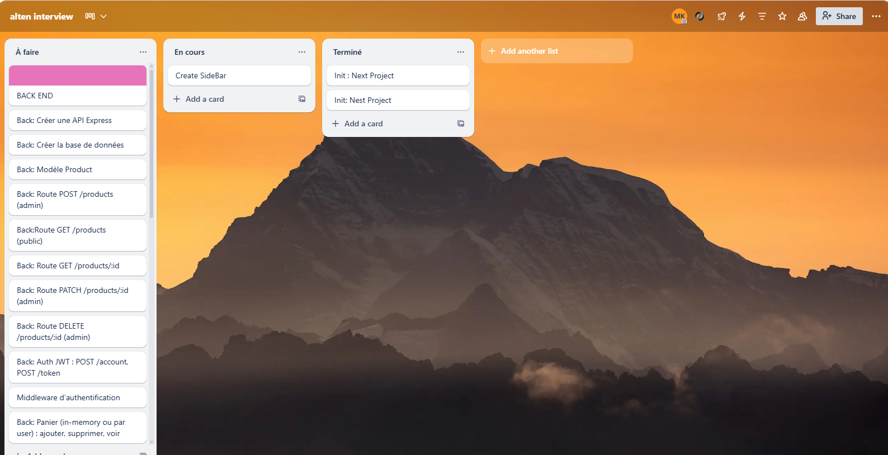

#  Test Technique – Alten

Ce projet a été réalisé dans le cadre du test technique proposé par **Alten**.  
Il s'agit d'une application web complète avec une architecture **Full Stack** basée sur **Next.js** pour le frontend et **NestJS** pour le backend.

---

## Organisation du projet

Le projet est structuré de manière à respecter les bonnes pratiques d’un développement en mode agile.

### Étapes de réalisation

1. Définition des besoins à partir du sujet fourni.
2. Organisation des tâches sous forme de tickets.
3. Suivi de l'avancement via un tableau Trello.
4. Développement du backend avec NestJS.
5. Développement du frontend avec Next.js.


---

##  Gestion de projet

L'organisation des tâches a été réalisée sur **Trello**. Voici un aperçu du tableau utilisé :



Chaque fonctionnalité a été divisée en **tickets** avec des étapes précises :  
- À faire  
- En cours    
- Terminé  

---

##  Stack Technique

### Frontend
- Framework : **Next.js**
- Langage : **TypeScript**
- UI : Tailwind 
- Authentification : JWT


### Backend
- Framework : **NestJS**
- Base de données : PostgreSQL 
- ORM : Prisma
- API : REST
- Authentification : JWT 

---

## Lancer le projet

### Backend (NestJS)

```bash
cd backend
npm install
npm run start:dev
```

### Backend (NestJS)

```bash
cd backend
npm install
npm run dev
```
